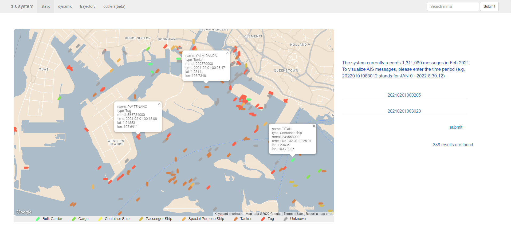
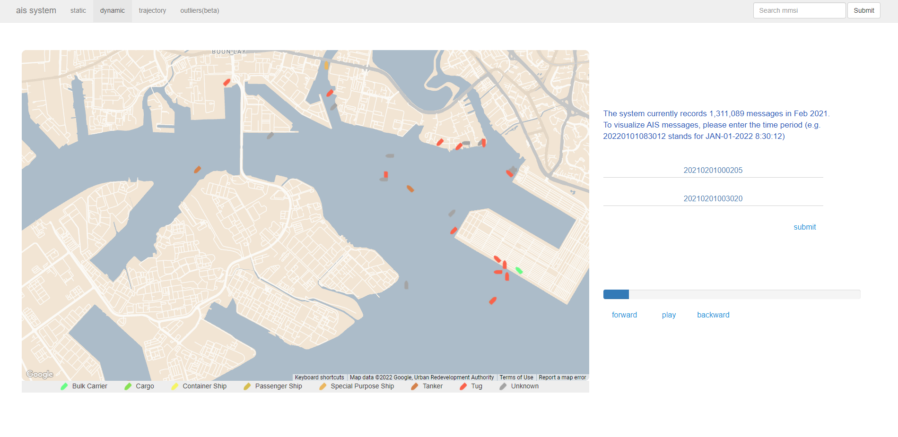
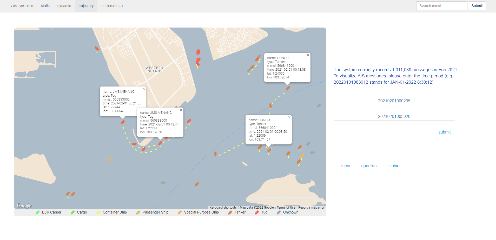
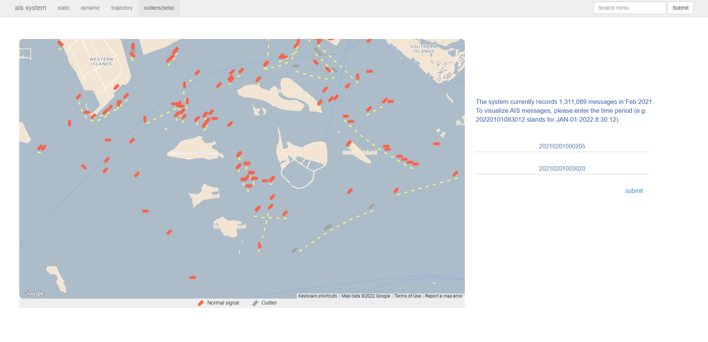

#  AIS visualization system

## Introduction

AIS is a powerful tool that can track vessels and help manage maritime traffic. In this project, we designed and implemented a web application for the visualization and analysis of maritime data near Singapore. The project introduced Google map for the visualization of AIS data, and several machine learning models to detect outliers for AIS signals and vessel trajectories. The web application is implemented by Flask framework. We also employed a web crawler for detailed data. The application could visualize static data and animated trajectories, and display outliers trajectories for a given time interval. The web service achieved clear visualization and high query efficiency, which meet user demands of maritime data access, and outlier analysis for maritime traffic management.

### Static view

+ This page shows the map and markers that representing AIS signals.
+ By clicking the marker, a info window with detailed information about the vessel
   will pop up.

### Dynamic view

+ Given a query time interval, markers that representing AIS signals
   would be displayed on the map, and moves on the interpolated curve over time.
+ The progress bar on the right provides the feature to play the movement animation in a customized speed.

### Trajectory view

+  The trajectory page offers users with simulated trajectories based on different
   spline functions.

### Outlier view

+  With the input time interval, markers that representing AIS signals
   would be displayed on the map, where different colors distinguish normal signals
   and outlier ones.

